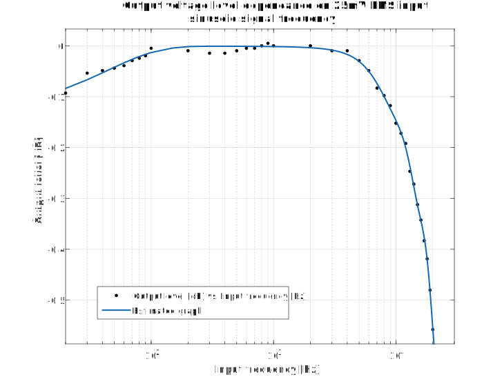
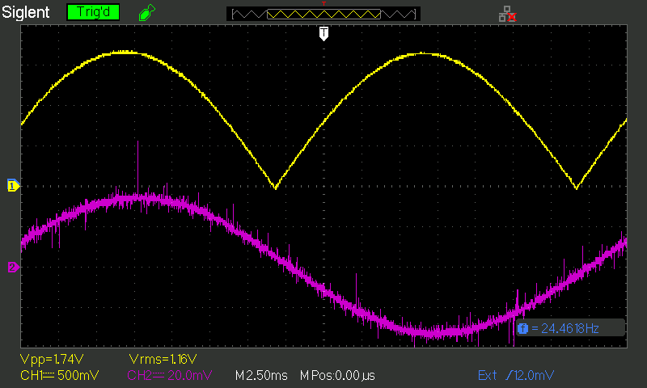

# VU_Meter_Deck
Retro audio level indicator with analog driver circuit.
\
The goal of this project is to create analog driver circuit for analog VU meter gauges. This device works with standard line level audio signals and is meant to be connected paralell to audio source and reciever (headphones or amplifier). VU Meter Deck is equipped with two sets of RCA and 1/4 inch audio jack connectors, where one set is meant to be conneced to audio source and the other to reciever as a pass-through configuration.

## Driver circuit

The driver circuit is fully analog made using TL084 quad op amps for processing (one per channel). It is meant to powered by an external 12V DC 200mA power supply. 

The circuit performs these functions:

- amplify input audio signal that arbitrarly selected value of 25mV RMS will be able to achieve 0dB on gauge's scale,
- rectify ampified signal by using op amp precision full-wave rectifier circuit,
- calculate the average of recified signal by using RC circuit,
- bufer the signal to analog gauges,
- provide input and output overvoltage protection.

## Measurments and characteristic of driver circuit

Output voltage level for 25mV RMS sinusoidal signal has been measured for different frequencies and plotted on graph below using MATLAB and Curve Fitter Toolbox. Gaussian aproximation was used to create aproximating function. For this plot, output for 1kHz sine was used as a reference value.

## Contributors
Szymon Bartosik